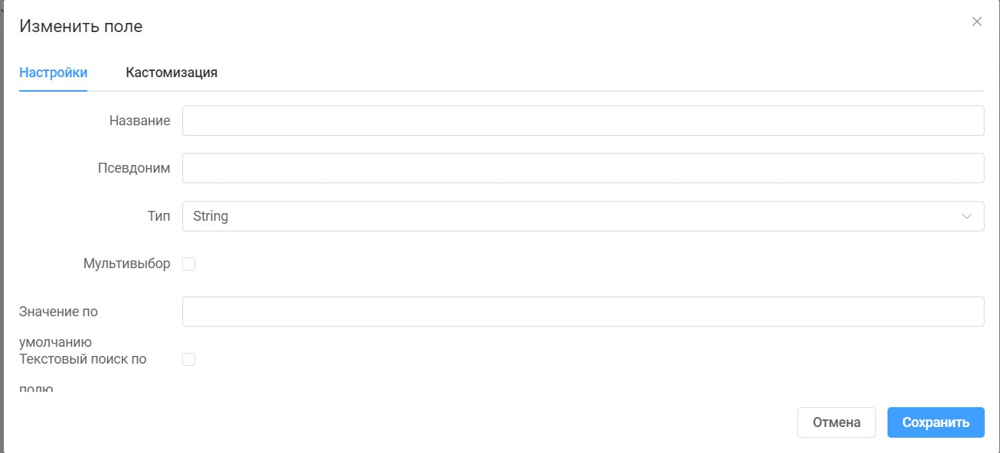

# Источники данных

Источники данных необходимы для выбора и распределения атрибутов/полей на вкладке "Страница".

## На странице добавления присутсвуют следующие поля необходимые для заполнения:

- `Заголовок` - текстовое поле, служит для отображения названия на странице источников данных, так и при добавлении источника на страницу;
- `Псевдоним` - текстовое поле, служит для обращения к источнику данных функциями;
- `Источник` - раскрывающийся список, в котором отображены способы добавления источников данных.
- `Древовидный` - чекбокс, устанавливается в случае, когда источник данных будет в древовидном формате(с полями,которые содержат в себе дополнительные поля)
- `Только чтение` - чекбокс, прожимается в случае, когда источник данных нельзя изменять и необходимо только как справочные значения.
- `Агрегатор` - чекбокс, служит для данных которые требуют агрегации, например для остатков товара на складах.

## Типы данных в списке "Источник"

- `Number` - ввод только числовых значений.
- `String` - ввод числовых, текстовых значений, так же спецсимволы
- `Boolean` - чекбокс
- `Text` - поле "string" наибольшей емкости.
- `Password` - ввод пароля, скрываются \*.
- `Enum` - выбор значений из списка.
- `Image` - прикрепление фотографии.
- `Datetime` - ввод даты и времени.
- `Date` - ввод даты.
- `Time` - ввод времени
- `Link` - выбор клиента из базы данных.
- `Table` - выбор отображение в виде таблицы других источников данных.

## Для заполнения полей источника данных необходимо:

1. Открыть вкладку "Данные".
2. В таблице будут отображены все поля, которые были добавлены на предыдущей вкладке "Поля".
3. Для добавления значений в поля необходимо нажать кнопку "Добавить".
4. Вписать соответствующие значения в раскрывшуюся строку.
5. Нажать в правом верхнем углу "Сохранить".

## Добавление полей

1.  Нажать кнопку "Добавить".
2.  В плагине необходимо заполнить поля:

- `Название`- название поля отображаемое пользователю по умолчанию.
- `Псевдоним`- название прле латиницей, необходимое для работы со скриптами.
- `Тип`- выбор типа поля.
- `Мультивыбор`- при установке чекбокса доступно для выбора множественное значение.
- `Значение по умолчанию`- значение которое будет отображено пользователю по умолчанию.
- `Текстовый поиск по полю`- возможен поиск по данному полю.

3. Нажать кнопку "Сохранить"

## Настройка выполнения функции при добавлении/удалении/обновлении источника данных

**Для настройки функционала необходимо:**

1. На странице добавления нового поля в источник данных необходимо перейти на вкладку "События".
2. Нажать на кнопку "Добавить".
3. В поле `Event` выбираем при какой действии должна срабатывать функция.
4. В поле `Handler` выбираем необходимую функцию.

## Настройка разрешения на добавление/изменение/удаление источника данных.

**Для настройки функционала необходимо:**

1. На странице добавления нового поля в источник данных необходимо перейти на вкладку "Разрешения".
2. В выпадающих списках выбрать роли, которые могут выполнить действие.
