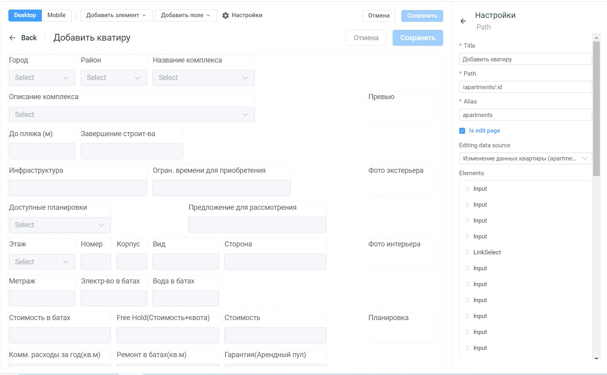

# Настройка страниц: Пошаговое руководство

Страницы необходимы для отображения и работы с данными для пользователя.

## Как настроить страницы в Tabbled

**Для создания новой страницы необходимо:**

1.  В вертикальном меню нажать на элемент бокового меню "Конфигурация".
2.  В открывшимся меню нажать на владку "Страницы".
3.  Нажать кнопку "Добавить".
4.  Будет доступно для выбора 2 вида шаблона страницы:

- `Grid` - распределение полей будет по сетке. Страница будет разделена на 12 колонок,в каждую из которых можно будет расположить атрибут/поле.
- `Flex` - при данном виде шаблона распределение полей происходит друг за другом.

5. При выборе шаблона открывается страница, где необходимо добавлять поля.
6. Добавить необходимые поля.
7. Заполнить поля
   - `Title` - название страницы, которое будет отображено во вкладке "Страницы".
   - `Path` - путь, необходимо указывать через "**/**" латиницей.
   - `Alias` - название страницы латиницей, необходимо для подключение функции.
8. Нажать "Сохранить".

## Новый элемент

**Для добавления общего элемента необходимо:**

1. В верхней части страницы нажать "Добавить элемент".
2. Перетащить элемент из списка в грид.
3. Нажать "Сохранить".

## Виды элементов
- `Table` - добавляет таблицу на страницу.
- `Link select` - позволяет выбирать значения из выпадающего списка, источником для списка является либо поле с типом "link" или "enum".
- `Checkbox` - добавляет поле-чекбокс.
- `Input` - добавляет поле для введения текстовых или числовых значений.
- `Datetime input` - добавляет поле для введения даты и времени.
- `Image` - добавялет поле для размещения изображений.
- `File` - добавляет поле для загрузки файлов в систему.
- `Status filter` - позволяет добавить фильтр для таблицы, источник для значений фильтра является поле с типом "enum".
- `Tree filter` - добавляет из источника данных выпадающий древовидный список.
- `Rich Text Editor` - добавляет поле расширенный текстовый редактор, с возможностью изменения текста(шрифт, размер, подчеркивание)

## Новое поле

**Для добавления поля из источника данных необходимо:**

1. В правом вертикальном меню в поле "Editing data source" выбрать необходимый источник данных.
2. В верхней части страницы нажать "Добавить поле".
3. Перетащить элемент из списка в грид(все поля берутся из выбранного источника данных).
4. Нажать "Сохранить".

## Логика полей

**Все добавленные элементы можно индивиуально настроить. Для этого существуют следующие настройки:**

- `Title` - название для поля. Автоматически подтягивается название с источника данных.
- `Disabled` - блокирование поля.
- `Readonly` - невозможность ввести/изменить значение в поле.
- `Autosize` - автоматическое изменение ширины поля, при введении/изменении значения.
- `Visibility` - показывать/скрывать поле в зависимости от условий.

## Сервисные поля

- `Is edit page` - чекбокс необходим для сохранения данных введенных в поля. Для пользователя выглядит как страница, где можно ввести значения и сохранить.
- `Elements`- будут отображаться элементы, которые расположены на странице.

## Права доступа

- `Access` - определение доступа для данной страницы.
- `Roles` - выбор ролей имеющий доступ к данной странице.

## События

- `Header actions` - записанная функция выполняется при клике на заголовок.
- `onOpen` - записанная функция выполняется после открытия страницы
