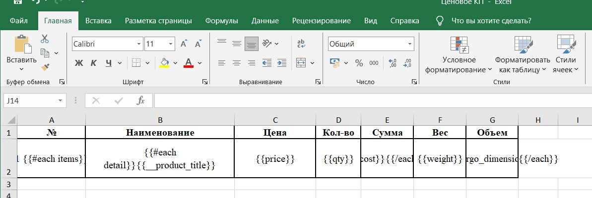

# Настройка шаблонов печати

Основы настройки в видео уроке:
[](https://www.youtube.com/watch?v=ZJwVLulb55A)

Шаблоны используются для вывода информации в форматах PDF и Excel, обеспечивая структурированный и стандартизированный способ отображения данных.

## Добавление шаблона
1. В вертикальном меню нажать на элемент бокового меню "Конфигурация".
2. В открывшимся горизонтальном меню нажать на владку "Шаблоны отчетов".
3. Нажать кнопку "Добавить".
4. Заполнить поля
   - `Title` - название функции, которое будет отображено при выборе в источнике данных.
   - `Alias` - название функции латиницей, необходимо для обращения функции.
   - `Pages` - название страниц, в которых срабатывает функция ?.
   - `Template format` - выбор формата шаблона.
   - `Can view` - ограничения прав доступа на просмотр.
5. Нажать "Сохранить".

## Шаблон HTML to PDF
При данном формате используется язык HTML.

Имеет следующий вид
````md
<style type="text/css">
.tg  {border-collapse:collapse;border-spacing:0;margin:0px auto;}
.tg td{border-color:black;border-style:solid;border-width:1px;font-family:Arial, sans-serif;font-size:14px;
  overflow:hidden;padding:2px 2px;word-break:normal;}
.tg th{border-color:black;border-style:solid;border-width:1px;font-family:Arial, sans-serif;font-size:14px;
  font-weight:normal;overflow:hidden;padding:2px 1px;word-break:normal;}
.tg .tg-0pky{border-color:inherit;text-align:left;vertical-align:top}
.tg .tg-0lax{text-align:left;vertical-align:top}
</style>

{{#each products}}
<table class="tg" style=" width: auto; margin: 0;">
    <colgroup>
        <col style="width: 400px">
        <col style="width: 50px">
        <col style="width: 300px">
    </colgroup>
<thead>
    
    <tr>
        <td class="tg-0lax">{{name}} </td>
        <td class="tg-0lax">{{qty}}</td>
        <td class="tg-0lax"><br></td>
    </tr>
    
</thead>
</table>
{{/each}}
````
Чтобы задать стиль шаблона в HTML, используется тег `<style type="text/css">`. Затем создана таблица с помощью тега `table`. Чтобы передать данные со страниц в шаблон, используем цикл `{{#each products}}` `{{/each}}`, созданный скриптами. Чтобы вставить нужное значение в шаблон, указываем его псевдоним, указанный в источнике данных, например, `{{псевдоним}}`.

**Скрипт**

Обязателен для заполнения для создания и возврата массива.
Имеет следющий вид 

````md
async function prepare() {

        let customers = await dataSources.getByAlias('customers');
        let products = await dataSources.getByAlias('products');
        let allDetails = {}
        
        let dt = {
            customer: await customers.getById(ctx.item.client),
            moment: ctx.item.moment,
            num: ctx.item.number,
            status: ctx.item.status,
            note: ctx.item.note,
            products: []
        }
        
        for(let i in ctx.item.details) {
            let item = ctx.item.details[i]
            let prod = await products.getById(item.product)
            
            console.log(prod)
            
            if (!prod)
                continue
            
            if (prod.type == "product" && prod.manufacture_type === 'third_party') {
                let p = {
                    id: prod.id,
                    name: prod.name,
                    qty: item.qty
                }       
                dt.products.push(p)
            }
        }
        return dt
    }

return prepare()
````

## Шаблон Excel
При данном формате используется файл Excel c последующей загрузкой в систему.

Имеет следующий вид



Создается необходимая таблица. Также, чтобы передать данные со страниц в шаблон, используем цикл `{{#each items}}` `{{/each}}`, созданный скриптами.

**Скрипт**

В данном случае скрипт не будет отличаться от шаблона HTML.


Для проверки работы шаблонов на данной странице необходимо во вкладке "Контекст" добавить JSON.
Может иметь следующий вид

````md
{
    "selected": ["1722437299427348480"] // selected уникальный идентификатор документа в системе.
}
````